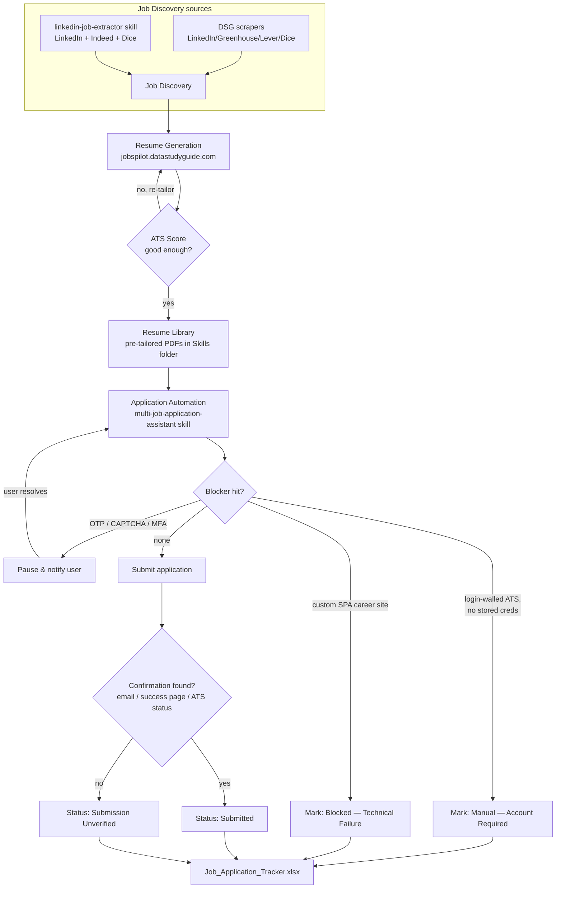

# Automate Job Hunt — End-to-End Flow

This is the umbrella README for the full job-hunting pipeline: **discover → tailor → apply → track**.
It ties together three pieces that live in different places:

| Piece | What it is | Where |
|---|---|---|
| **JobPipeline (DSG)** | Django app — job ingestion, resume generation, ATS scoring | [`DSG/`](DSG/), live at [jobspilot.datastudyguide.com](https://jobspilot.datastudyguide.com/) |
| **Job Application Skill** | Claude Code skill that drives a browser to fill & submit applications | `~/.claude/Skills/multi-job-application-assistant/` |
| **JobPilot (Automate_Applying)** | A separate, fully-coded 5-agent apply pipeline (Playwright, no chat needed) | `Automate_Applying/` (sibling project) |

The Django app has its own setup README at [`DSG/README.md`](DSG/README.md). This document is about the
**process**, not the install steps.

## Flow Diagram

## Stage by Stage

### 1. Job Discovery
- **DSG (JobPipeline)** — `manage.py ingest_jobs` (Greenhouse/Lever), `ingest_linkedin_jobs` (Selenium), `import_dice_jobs`. Runs on a schedule, writes to the `Job` model, feeds the `/jobs/` feed.
- **`linkedin-job-extractor` skill** — an on-demand Claude Code skill that pulls Remote/Hybrid Senior DS/ML/GenAI roles from LinkedIn, Indeed, and Dice into an Excel export, filtered to Fortune 500 + posted within 3 days.

### 2. Resume Generation & ATS Scoring
- Live at **[jobspilot.datastudyguide.com](https://jobspilot.datastudyguide.com/)** — paste a job description (or a `job_id` from the feed), get an LLM-drafted, LaTeX-rendered PDF resume plus an ATS match score (matched/missing keywords).
- This is the `resumes` Django app inside DSG: user/job foreign keys, per-user history, batch generation.

### 3. Resume Library (fallback pool)
- Because live generation takes **~5-6 minutes per resume**, the Skills folder keeps a pre-tailored pool for fast turnaround:
  - `20+Applications_Resume/` — 11 role-variant resumes (Senior DS, AI Engineer, GenAI Engineer, MLE, Principal-level, etc.) mapped to job-title patterns in its own `CLAUDE.md`, plus supporting patents/publications.
  - `Resumes_<date>/` (e.g. `Resumes_12th_August/`) — a freshly-generated batch for a specific day's applications, tried first before falling back to the general pool.

### 4. Application Automation
The **`multi-job-application-assistant`** skill takes a batch of job links and, using Claude in Chrome / computer-use, opens each one, matches a resume, checks fit, fills the form, and submits — continuously, without stopping between jobs.

### 5. Tracking
Every run ends in a tracker (`Job_Application_Tracker.xlsx`) with: Company, Position, Resume Used, Fit Score, Status, Submission Evidence, Date, Notes.

---

## What's Good About This Skill

1. **Runs the whole batch unattended** — it doesn't stop after one application to ask "should I continue?"; it works through every link and only interrupts for things that *genuinely* need a human.
2. **Won't fabricate anything** — resume tailoring and application answers are constrained to truthful, existing experience; nothing is invented to better match a JD.
3. **Treats "Submit clicked" as unproven** — it actively looks for an email confirmation, success page, or "Applied" status before marking anything `Submitted`. If none of that shows up, it's honestly labeled `Submission Unverified` rather than assumed successful.
4. **Pauses instead of skipping** on OTP/CAPTCHA/MFA/e-signature — the default failure mode for most automations is to give up on the job; this one parks that one application, tells you exactly what it's waiting on, and resumes immediately once you clear it.
5. **A real legal safety gate** — consent/arbitration/class-action-waiver checkboxes are never pre-authorized in bulk; it fills everything else and asks per-application before checking that box.
6. **Site-specific muscle memory baked in** — e.g. the Greenhouse embed-bypass URL pattern for career pages that block page reads, and the "click → type → Enter" trick needed for React-select comboboxes that silently revert on a plain text-set. These aren't rediscovered every run.
7. **Hard disqualifiers are enforced up front** — roles needing active security clearance/citizenship or sponsorship are marked `Ineligible` and skipped rather than wasting a submission.
8. **Resume matching is content-based, not filename-based** — it reads the JD and the resume before choosing, rather than pattern-matching on the file name.

## Where It Falls Short of "Fully Applies to Everything"

1. **Custom SPA career sites break the upload step.** Canonical Greenhouse (`boards.greenhouse.io`) works reliably, but company-hosted single-page apps (Stripe was tested and failed) render no accessible file input or iframe — there's no standard DOM to attach a resume to. Each of these needs bespoke handling; there's no generic fix.
2. **Login-walled ATS platforms (Workday, iCIMS, SuccessFactors, Dice, etc.) need a standing account + credential-manager access.** Without that wired up, the skill correctly refuses to guess or create an account — it marks the job `Manual — Account Required` and moves on. Nothing gets submitted there without you.
3. **CAPTCHA and MFA are hard stops by design**, not solvable automation — every pause here is a real wait on the user, so a long batch full of CAPTCHA'd sites is slow in practice.
4. **Indeed is unimplemented, on purpose** — no public API and CAPTCHA-protected, so it's left out rather than silently returning zero results that look like "nothing found."
5. **Submission confidence has a ceiling.** If a site gives no confirmation email and no visible success state, the best the skill can honestly say is "Unverified" — it can't force certainty that doesn't exist.
6. **It's disconnected from the actual codebase.** This skill drives a browser directly; it doesn't call DSG's `/resumes/api/generate/` endpoint or JobPilot's coded Apply Agent. So a skill-run application and a JobPilot-run application don't share a database, dedupe list, or ATS score — they're two independent systems solving the same problem differently (chat-driven vs. fully coded/Playwright).
7. **Two conflicting playbooks exist side by side** — the careful `SKILL.md` (verify everything, never skip on human-verification, log every reason) and a leaner `apply.md` draft that explicitly trades validation for speed ("skip unnecessary validation," "prioritize speed over extensive analysis," parallel submission). They haven't been reconciled, so which philosophy applies depends on which one gets invoked.
8. **The fallback resume pool can drift stale.** It exists to dodge the live site's ~5-6 minute generation time, but nothing keeps it automatically in sync with the live generator's latest tailoring quality — it's only as fresh as the last manual batch.
9. **Large-scale job search from DSG's own library is impractical**, not because of the skill but because `/api/jobs/search/` scores every job against the candidate per request and has taken 150s+ without returning on ~950 jobs. Direct public-board sources (Greenhouse/Lever/Ashby/Workday) are the practical path at volume.

## Related: JobPilot (Automate_Applying)

A separate, code-native cousin of this skill lives at `Automate_Applying/` — five single-responsibility agents (Orchestrator, Search, Resume, Apply, Integration) built with Playwright instead of chat-driven browser control, writing results to Google Sheets instead of an Excel tracker. It reuses this same JobPipeline resume generator over HTTP. As of the last verified state: resume generation and canonical-Greenhouse applying both work end-to-end (dry run); company-hosted SPA career sites remain the shared open problem across *both* systems.
